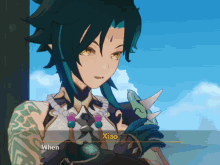

<!-- Author: rizkylsmp -->

  

  

# Hi there 👋

- 📆 24/07/02
- 📠<a href="https://opac-lumajang.polinema.ac.id">Politeknik Negeri Malang PSDKU Lumajang</a> - Teknologi Informasi 
- ❤️ Anime, Games
  

📺 Favourite Animes

    <ul>
      <li><a href="https://anilist.co/anime/11757/Sword-Art-Online">Sword Art Online</a></li>
      <li><a href="https://anilist.co/anime/11771/Kuroko-no-Basket">Kuroko no Basuke</a></li>
      <li><a href="https://anilist.co/anime/16498/Shingeki-no-Kyojin">Attack on Titan</a></li>
    </ul>
    

  

🮠Favourite Games

    <ul>
      <li>Genshin Impact</li>
      <li>Suikoden</li>
      <li>Grand Chase</li>
    </ul>
    

- 💙 Web / Game Programing
- 🌐 <a href="https://rizkylsmp.my.id">rizkylsmp.my.id</a>

   

# Skills 🎨

  <h3 align=center>👨‍💻Tech Stack👨‍💻
    

🛠️Tools🛠️
  

 

# Stats 📈

&nbsp;
 
<!-- Streak API-->

